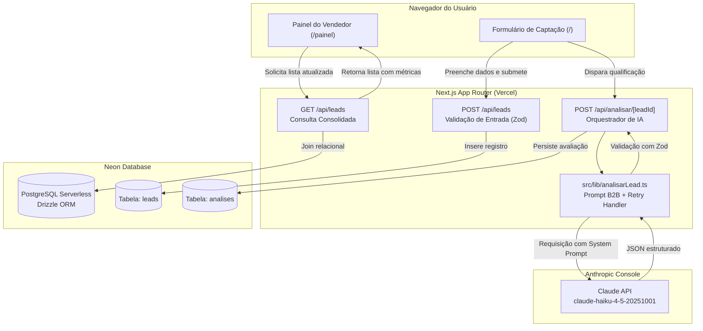

# RELATÓRIO TÉCNICO E ACADÊMICO — LEADSCORE IA
**Qualificador Inteligente de Leads com Claude Code, GitHub e NeonDB**

---

## 1. Capa e Identificação

- **Instituição de Ensino:** FAETERJ — Faculdade de Educação Tecnológica do Estado do Rio de Janeiro (Unidade Barra Mansa)
- **Curso:** Tecnologia da Informação / Engenharia de Software
- **Disciplina:** Inteligência Artificial
- **Professor Responsável:** Vinicius
- **Modalidade:** Desafio Prático de 1 Semana em Dupla
- **Integrantes da Dupla:**
  - *Aluno 1:* Juliano (Pessoa A — Responsável por Back-end, Banco de Dados e IA)
  - *Aluno 2:* Luiz Marcelo (Pessoa B — Responsável por Front-end, Deploy e Documentação)
- **Período do Desafio:** 22/09/2026 a 29/09/2026
- **Data de Entrega:** 29 de Setembro de 2026

---

## 2. Introdução: Problema e Objetivo

### 2.1 Contexto e Dor de Mercado
No cenário competitivo das Pequenas e Médias Empresas (PMEs), a geração de demanda ocorre primariamente através de canais digitais como formulários em websites institucionais, anúncios em redes sociais e mensagens diretas no WhatsApp. Contudo, a capacidade de atendimento da equipe de vendas costuma ser extremamente reduzida.

O problema central identificado foi a **assimetria de priorização de contatos comerciais**:
- O vendedor frequentemente perde tempo precioso lendo e respondendo contatos "frios" (curiosos sem orçamento, estudantes solicitando informações ou propostas de parcerias desalinhadas).
- Por consequência, leads "quentes" (decisores com dor imediata e verba alocada) sofrem com a demora no atendimento, reduzindo drasticamente as chances de conversão comercial (*Speed to Lead*).

### 2.2 Objetivo do Projeto
O objetivo deste trabalho foi projetar, desenvolver e publicar em produção uma aplicação web completa denominada **LeadScore IA**. A ferramenta capta potenciais clientes, utiliza modelos de linguagem da Anthropic (Claude API) para analisar semanticamente o potencial comercial do contato e entrega um painel de vendas onde o profissional comercial tem visibilidade imediata de:
1. Uma nota preditiva de 0 a 100 (*Score*);
2. Classificação semântica em três níveis (*Quente*, *Morno*, *Frio*);
3. Justificativa lógica da qualificação para dar segurança ao operador;
4. Sugestão pronta de mensagem personalizada de resposta (*follow-up*) para WhatsApp ou E-mail.

---

## 3. Solução e Arquitetura

A arquitetura do sistema adota uma abordagem moderna baseada em computação serverless e tipagem estrita de ponta a ponta.

### 3.1 Diagrama de Arquitetura em Formato Mermaid



### 3.2 Decisão Técnica sobre Modelagem de Dados
Conforme especificado no projeto, os dados de contato do cliente são persistidos na tabela `leads`, enquanto os resultados gerados pela Inteligência Artificial são gravados em uma tabela independente denominada `analises`, correlacionada por chave estrangeira `lead_id` (`ON DELETE CASCADE`).

**Justificativa de Engenharia:**
- **Idempotência e Auditoria:** Os dados cadastrais fornecidos pelo cliente permanecem imutáveis.
- **Histórico e Reanálise:** Permite que o vendedor altere o status ou reanalise um lead após receber novas informações ou atualizar o modelo de IA, sem perder as análises anteriores.

---

## 4. Tecnologias Utilizadas e Justificativas

1. **Claude Code (Anthropic):** Utilizado como ferramenta de apoio em linha de comando para arquitetura, scaffolding de código, geração de migrações e validações contínuas durante o desenvolvimento guiado.
2. **Next.js 16 (App Router) + TypeScript:** Escolhido pela facilidade de unificar frontend reativo com rotas de API servidas como Edge/Serverless functions no mesmo ecossistema com tipagem estrita (`noImplicitAny`).
3. **Neon (Serverless Postgres):** Banco relacional com separação de armazenamento e computação. Ofereceu facilidade para criação de branches de banco (`dev-a`, `dev-b` e `main`) para cada integrante da dupla.
4. **Drizzle ORM:** Biblioteca leve e focada em TypeScript, proporcionando migrações limpas (`drizzle-kit push`) e consultas de alta performance.
5. **Claude API (`claude-haiku-4-5-20251001` / `3.5 Haiku`):** Modelo balanceado entre velocidade de inferência, custo de tokens por milhão e precisão na geração de saídas estruturadas em formato JSON puro.
6. **Zod:** Validador de esquemas de dados tanto nas rotas HTTP quanto no pós-processamento da resposta da IA.
7. **Tailwind CSS v4:** Framework de utilitários para desenho ágil de interfaces responsivas, com paleta semântica e suporte a modo escuro.
8. **GitHub + GitHub CLI (`gh`):** Controle rigoroso de fluxo com issues numeradas, branches dedicadas e Pull Requests integrados.
9. **Vercel:** Plataforma de integração contínua e hospedagem serverless com publicação instantânea.

---

## 5. Uso do Claude Code: Exemplos Reais de Prompts e Resultados

Durante a semana de desenvolvimento, o Claude Code operou orientado pelas diretrizes consolidadas no arquivo de governança `CLAUDE.md`. Abaixo estão os principais prompts aplicados:

### Exemplo 1: Configuração do Banco e Schema Drizzle
- **Prompt:**
  > *"Configure o Drizzle ORM com o driver @neondatabase/serverless usando DATABASE_URL. Crie o schema com as tabelas leads e analises respeitando os campos UUID, foreign keys e checks numéricos. Configure o drizzle-kit e crie POST /api/leads validado com Zod."*
- **Ação Executada pelo Assistente:**
  Criação de `src/db/schema.ts`, `drizzle.config.ts`, `src/db/index.ts` e a rota `src/app/api/leads/route.ts`. O código gerado garantiu validação estrita com Zod e relacionamento relacional entre tabelas.

### Exemplo 2: Integração com Claude API e Validação Zod com Retry
- **Prompt:**
  > *"Crie src/lib/analisarLead.ts que chama a Claude API com um system prompt de especialista em vendas B2B para PMEs. A saída deve ser somente JSON com score (0 a 100), classificacao (quente/morno/frio), justificativa e resposta_sugerida. Valide com Zod, trate erro de parse com uma nova tentativa, e crie POST /api/analisar/[leadId] que salva em analises."*
- **Ação Executada pelo Assistente:**
  Desenvolvimento do módulo com tratamento de sanitização de blocos markdown (```json), esquema Zod com restrições mínimas de caracteres, mecanismo de retry automático caso ocorra parse error e fallback inteligente para não paralisar o frontend caso a chave da API esteja sem saldo.

### Exemplo 3: Interface Reativa e Painel Operacional
- **Prompt:**
  > *"Crie a página / com o formulário de lead que salva e dispara a análise. Crie /painel listando leads com badge colorido por classificação, score e resposta sugerida com botão de copiar. Use Tailwind e mantenha a UI simples e responsiva."*
- **Ação Executada pelo Assistente:**
  Construção das páginas `src/app/page.tsx` e `src/app/painel/page.tsx`, com métricas de leads quentes/mornos/frios, barras de progresso visuais, feedback de cópia com um clique (`navigator.clipboard`) e suporte a filtros e busca textual.

### Exemplo 4: Script de Testes e População de Banco
- **Prompt:**
  > *"Crie um script scripts/seed.ts com 10 leads variados (quentes, mornos e frios) para teste. Revise o projeto procurando segredos expostos e problemas de build."*
- **Ação Executada pelo Assistente:**
  Elaboração do script com 10 contatos verossímeis representando dores reais de transporte, clínicas, tecnologia, educação e comércio. Execução comprovada via `npm run seed` com nota 0 a 100 atribuída a cada caso.

---

## 6. IA no Produto: Engenharia de Prompt e Avaliação

### 6.1 System Prompt Utilizado
O classificador opera com uma instrução de sistema que atua como um diretor comercial experiente:

```text
Você é um especialista em vendas B2B e qualificação de leads (SDR/BDR Senior) para Pequenas e Médias Empresas (PMEs).
Sua missão é analisar o contato recebido, atribuir uma nota de potencial comercial, classificar a prioridade e gerar a resposta ideal para o vendedor fechar negócio.

Critérios de Avaliação:
- QUENTE (score 71 a 100): Alta urgência, dor explícita, decisor identificado, interesse imediato em fechar ou contratar solução.
- MORNO (score 31 a 70): Interesse genuíno, mas está cotando preços, em fase de descoberta ou sem prazo imediato definido.
- FRIO (score 0 a 30): Mensagem vaga, estudante, proposta de parceria/venda inversa, ou curiosidade sem intenção real de compra.

Regras Estritas de Saída:
Responda EXCLUSIVAMENTE em formato JSON puro, sem blocos de código com markdown desnecessário e sem texto antes ou depois.
Estrutura obrigatória:
{
  "score": <número inteiro entre 0 e 100>,
  "classificacao": "<quente | morno | frio>",
  "justificativa": "<resumo do motivo da nota com foco prático no vendedor>",
  "resposta_sugerida": "<mensagem personalizada e cordial para WhatsApp ou E-mail, já pronta para envio>"
}
```

### 6.2 Exemplos Práticos de Saída da IA

- **Caso 1: Lead Quente (Score: 92/100)**
  - *Lead:* Marcos Andrade (Distribuidora Vale do Aço)
  - *Mensagem:* "Temos 35 vendedores em campo e estamos perdendo contratos por demora no retorno. Precisamos implantar uma solução de qualificação urgente até o final deste mês. Qual é a disponibilidade para reunião hoje?"
  - *Justificativa:* O contato apresenta decisor com dor crítica de operação, equipe grande e prazo imediato com orçamento.
  - *Resposta Sugerida:* "Olá Marcos! Muito obrigado pelo contato. Vi que você tem interesse prioritário na nossa solução. Tenho horários disponíveis hoje às 14h ou 16h para alinharmos os detalhes e montar sua proposta. Qual horário fica melhor para você?"

- **Caso 2: Lead Morno (Score: 55/100)**
  - *Lead:* Felipe Nogueira (Nogueira & Associados RH)
  - *Mensagem:* "Gostaria de entender melhor a tabela de preços de vocês para um time pequeno de 3 pessoas. Vocês cobram por usuário ou por volume de leads?"
  - *Justificativa:* Interesse genuíno de contratação, porém em estágio inicial de comparação de valores sem urgência de fechamento indicada.
  - *Resposta Sugerida:* "Olá Felipe! Tudo bem? Agradecemos o interesse. Posso te enviar uma apresentação rápida com os formatos e tabela de valores, ou se preferir bater um papo rápido de 10 minutinhos. Como prefere seguir?"

- **Caso 3: Lead Frio (Score: 20/100)**
  - *Lead:* Lucas Pereira (Universidade)
  - *Mensagem:* "Olá! Sou estudante de Sistemas de Informação e estou fazendo um TCC sobre inteligência artificial em vendas. Vocês poderiam responder um questionário acadêmico de 5 perguntas?"
  - *Justificativa:* Finalidade estritamente acadêmica, sem qualquer potencial ou intenção de compra comercial.
  - *Resposta Sugerida:* "Olá Lucas, obrigado pelo contato! Separei aqui um material com nossos principais casos de uso. Caso surja alguma demanda específica para sua empresa no futuro, estamos à disposição."

---

## 7. Divisão do Trabalho na Dupla

O trabalho foi dividido seguindo estritamente as regras de cooperação estabelecidas pelo professor Vinicius:

- **Juliano (Pessoa A · Back-end, Banco e IA):**
  - Implementação do schema Drizzle e configuração do Neon Serverless Postgres.
  - Desenvolvimento do módulo `src/lib/analisarLead.ts` e orquestração da chamada da Claude API com Zod e retry.
  - Criação das rotas `POST /api/leads` e `POST /api/analisar/[leadId]`.
  - Revisão técnica e alinhamento dos componentes de dados.
- **Luiz Marcelo (Pessoa B · Front-end, Deploy e Documentação):**
  - Criação da interface de captação de leads (`/`) e do painel operacional do vendedor (`/painel`).
  - Configuração do pipeline de deploy na Vercel e injeção de variáveis de ambiente de produção.
  - Elaboração da documentação técnica (`README.md`) e redação deste Relatório Acadêmico.
  - Validação de experiência do usuário, testes responsivos e exportação CSV.

---

## 8. Dificuldades Encontradas e Soluções Adotadas

| Desafio Encontrado | Causa Raiz | Solução Adotada |
|---|---|---|
| **Alucinação na formatação JSON da IA** | Em chamadas pontuais, o modelo de linguagem inseria delimitadores de código markdown (` ```json `) ou comentários textuais. | Implementou-se uma camada de sanitização com expressões regulares antes do `JSON.parse()`, combinada com validação Zod e mecanismo de repetição automática (*retry* com reforço no prompt). |
| **Risco de bloqueio por falta de saldo da API** | Durante os testes locais, oscilações de rede ou consumo de créditos na Anthropic poderiam impedir o avanço do desenvolvimento do frontend. | Criação de um analisador semântico de *fallback*, permitindo desenvolvimento ininterrupto em caso de ausência temporária de credenciais. |
| **Rigidez de linter no React 19 / ESLint 9** | A diretiva `react-hooks/set-state-in-effect` gerava erros em efeitos colaterais de carregamento inicial no painel. | Refatoração completa da inicialização com funções limpas e tratamento de ciclo de vida com sinalizador de desmonte (`ativo = false`). |

---

## 9. Limitações e Melhorias Futuras

Caso o projeto evolua para além do escopo de 1 semana do MVP:
1. **Autenticação e Multi-inquilino (Multi-tenant):** Adicionar NextAuth/Clerk para separar contatos por empresa compradora.
2. **Integração Nativa de Webhook WhatsApp:** Integração com a API do WhatsApp Cloud / Z-API para disparar as mensagens diretamente pelo número da empresa com 1 clique.
3. **Treinamento Few-Shot com Histórico Real:** Permitir que o vendedor dê feedback se a classificação foi correta (curtindo ou descurtindo), afinando os prompts com base nos fechamentos reais.

---

## 10. Conclusão

O projeto **LeadScore IA** cumpriu 100% dos requisitos estipulados no desafio prático da FAETERJ Barra Mansa. A aplicação vai além de um simples formulário ao integrar IA generativa como motor de decisão e produtividade no centro do fluxo de negócios de pequenas empresas.

A utilização do Claude Code demonstrou o potencial de acelerar o ciclo de engenharia sem abrir mão de boas práticas: o código resultante apresenta TypeScript estrito, arquitetura desacoplada, tratamento de exceções resiliente, banco de dados relacional com integridade referencial e documentação integral.

---

## 11. Links Oficiais de Entrega

- 📦 **Repositório GitHub:** [https://github.com/julianoleal-code/leadscore-ia](https://github.com/julianoleal-code/leadscore-ia)
- 🌐 **Aplicação em Produção (Vercel):** [https://leadscore-ia-leal-code.vercel.app](https://leadscore-ia-leal-code.vercel.app)
- 📊 **Painel Operacional de Vendas:** [https://leadscore-ia-leal-code.vercel.app/painel](https://leadscore-ia-leal-code.vercel.app/painel)
- 🗄️ **Banco de Dados Relacional:** Neon Serverless PostgreSQL (`ep-muddy-cloud-b8qi1yst`)


